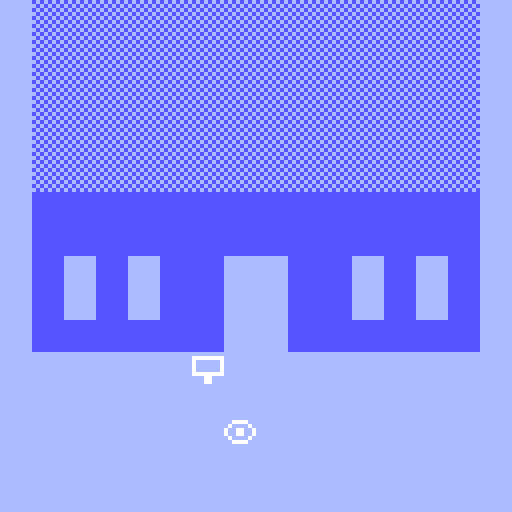

# b r 3

_There are 1.8446744e+19 possible 8x8 one bit images! But only some of them look like water! Here are 24 of them! Hand crafted, refreshing water! Everywhere! But not a drop to drink!_

## [Play _b r 3_](https://pippinbarr.github.io/b-r-3)

---

_b r 3_ is a remake of my water gallery [_v r 3_](https://www.pippinbarr.com/2017/03/29/v-r-3/) in the [Bitsy](http://ledoux.io/bitsy/editor.html) game maker.

Features water from: Fred Bednarski's [The World Has Been Sad Since Tuesday](https://vonbednar.itch.io/the-world-was-sad-since-tuesday), halkon's [Everything Must Fall](https://halkon.itch.io/everything-must-fall), mark wonnacott's [Flotsam](https://candle.itch.io/flotsam), eevee's [sandcastles](https://eevee.itch.io/sandcastles), chiropteram's [The Thing in the Lake](https://chiropteram.itch.io/the-thing-in-the-lake), Candal's [Seven Simple Wonders](https://candal.itch.io/sevensimplewonders), ruin's [fiddler's island, summer 2016](https://ruin.itch.io/fiddlers-island-summer-2016), Adam Saltsman and bexsaltsman's [Princess Peppercorn's Pug Plan](https://adamatomic.itch.io/peppercorn), lunafromthemoon's [Stranger Point](https://lunafromthemoon.itch.io/stranger-point), porpentine charity heartscape's [almanac of girlswampwar territory & the _girls who swim as fertilizer through the warm soil cloaking the roots of the glorious tree of eugenics (giving birth to a black hole in a walmart parking lot at 1am)](https://porpentine.itch.io/almanac) (water by Ada Rook), onion's [racing...](https://le-onionboi.itch.io/racing), Fladagus's [Apology Quest](https://fladagus.itch.io/apology-quest), Josefsen's [Lakewood Forest](https://josefsen.itch.io/lakewood-forest), LostTrainDude's [When I was a bubble I could talk with the trees](https://losttraindude.itch.io/when-i-was-a-bubble-i-could), efreeteater's [Eggway Dreams](https://efreeteater.itch.io/eggway-dreams), papercookies' [Talkative Plants](https://papercookies.itch.io/talkative-plants), ducklingsmith's [Zelda? I Hardly Knew 'Er](https://ducklingsmith.itch.io/zelda-i-hardly-knew-er), Emma Dee's [Randy G.'s Wild n' Wacky Beach Adventure](https://emmadaues.itch.io/randyg), Laiska's [an evening stroll](https://laiska.itch.io/an-evening-stroll), Juliette Amorati's [Once I was an Egg](https://julietteamorati.itch.io/once-i-was-an-egg), Elijah One's [Stream Explorer!](https://elijahone.itch.io/stream-explorer), Twisted Tree's [Silverybield Foss](https://twistedtree.itch.io/silverybield-foss), Claire Morely's [Breathe in](https://shimmerwitch.itch.io/breathe-in), and cecile richard's [beachcombing](https://haraiva.itch.io/beachcombing).

#### Read the [Press kit](https://pippinbarr.github.io/b-r-3/press) for press information
#### Read the [Process documentation](https://github.com/pippinbarr/b-r-3/blob/master/process/README.md) for process journal, to do list, and related work
#### Read the [Commit History](https://github.com/pippinbarr/b-r-3/commits/master) for step-by-step information about how the project was built
#### Look at the [Code Repository](https://github.com/b-r-3/chesses2) for source code etc.

---

All waters used belong to their respective authors. _b r 3_'s generator is open source software licensed under a [Creative Commons Attribution-NonCommercial 3.0 Unported License](http://creativecommons.org/licenses/by-nc/3.0/). You can obtain the source code from its [code repository](https://github.com/pippinbarr/b-r-3) on GitHub. Bitsy itself is a separate entity, you can check out its [code repository](https://github.com/le-doux/bitsy) on GitHub.
