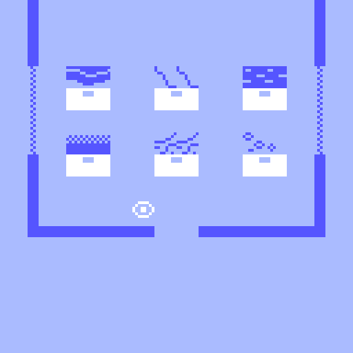
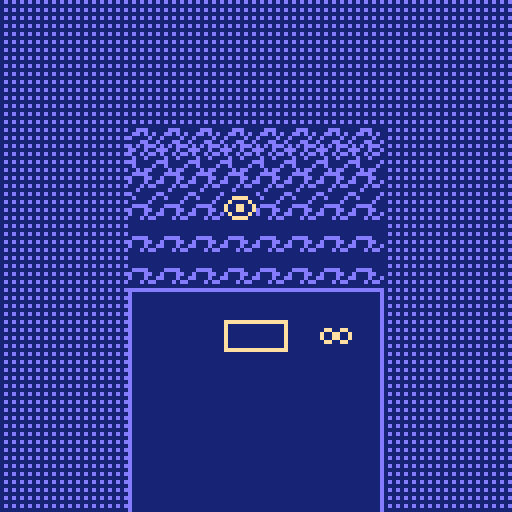
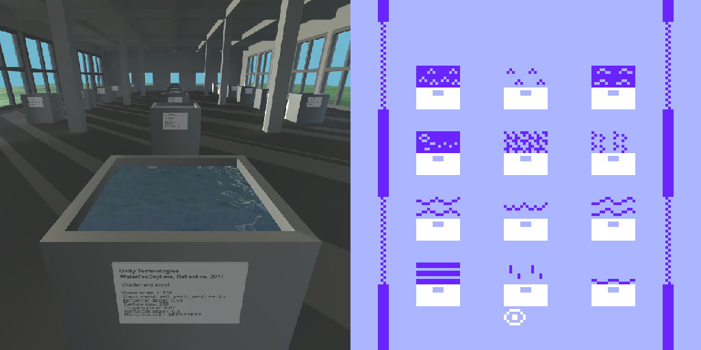

# _b r 3_ Press Kit

_There are 1.8446744e+19 possible 8x8 one bit images! But only some of them look like water! Here are 24 of them! Hand crafted, refreshing water! Everywhere! But not a drop to drink!_

#### [Play _b r 3_](https://pippinbarr.github.io/b-r-3) (Desktop and Mobile)

## The basics

* Developer: [Pippin Barr](http://www.pippinbarr.com/)
* Release: ...
* Platform: Browser (desktop and mobile)
* Code repository: https://github.com/pippinbarr/b-r-3
* Price: $0.00

## Who is this Pippin Barr guy?

Pippin is an experimental game developer who has made games about everything from [Eurovision](http://www.pippinbarr.com/2012/03/27/epic-sax-game/) to [performance art](http://www.pippinbarr.com/2011/09/14/the-artist-is-present/) to [dystopian post-work futures](http://www.pippinbarr.com/games/2017/07/03/it-is-as-if-you-were-doing-work.html). He's an Assistant Professor in the [Department of Design and Computation Arts](http://www.concordia.ca/finearts/design.html) at [Concordia University](http://www.concordia.ca/) in Montréal. He is also the associate director of the [Technoculture, Art, and Games (TAG)](http://tag.hexagram.ca/) Research Centre, which is part of the [Milieux Institute for Arts, Culture, and Technology](http://milieux.concordia.ca/).

## Description

_b r 3_ is a remake of my game [_v r 3_](https://www.pippinbarr.com/2017/03/29/v-r-3/), translating it from [Unity](https://unity.com/) to [Bitsy](https://ledoux.itch.io/bitsy). Given that Unity is a big ol' serious 3D game engine with lighting and all that, and Bitsy is a tiny game engine that provides only a 16x16 grid of 8x8 tiles, it's quite a translation process. In _b r 3_ as in _v r 3_ you enter a building which serves as a gallery of water. Inside, a series of plinths present different waters from existing Bitsy games and the visitor can both examine the water more closely as well as open the originating game itself. The objective, as with _v r 3_ is to centralize an element of (Bitsy) games that might otherwise tend to be overlooked in favour of narrative and spatial exploration. In _b r 3_ especially, however, the creative work of other game designers is foregrounded, as the water comes directly from other creations, rather than being a kind of commodity from an asset store as with _v r 3_.

Features water from: Fred Bednarski's [The World Has Been Sad Since Tuesday](https://vonbednar.itch.io/the-world-was-sad-since-tuesday), halkon's [Everything Must Fall](https://halkon.itch.io/everything-must-fall), mark wonnacott's [Flotsam](https://candle.itch.io/flotsam), eevee's [sandcastles](https://eevee.itch.io/sandcastles), chiropteram's [The Thing in the Lake](https://chiropteram.itch.io/the-thing-in-the-lake), Candal's [Seven Simple Wonders](https://candal.itch.io/sevensimplewonders), ruin's [fiddler's island, summer 2016](https://ruin.itch.io/fiddlers-island-summer-2016), Adam Saltsman and bexsaltsman's [Princess Peppercorn's Pug Plan](https://adamatomic.itch.io/peppercorn), lunafromthemoon's [Stranger Point](https://lunafromthemoon.itch.io/stranger-point), porpentine charity heartscape's [almanac of girlswampwar territory & the _girls who swim as fertilizer through the warm soil cloaking the roots of the glorious tree of eugenics (giving birth to a black hole in a walmart parking lot at 1am)](https://porpentine.itch.io/almanac), onion's [racing...](https://le-onionboi.itch.io/racing), Fladagus's [Apology Quest](https://fladagus.itch.io/apology-quest), Josefsen's [Lakewood Forest](https://josefsen.itch.io/lakewood-forest), LostTrainDude's [When I was a bubble I could talk with the trees](https://losttraindude.itch.io/when-i-was-a-bubble-i-could), efreeteater's [Eggway Dreams](https://efreeteater.itch.io/eggway-dreams), papercookies' [Talkative Plants](https://papercookies.itch.io/talkative-plants), ducklingsmith's [Zelda? I Hardly Knew 'Er](https://ducklingsmith.itch.io/zelda-i-hardly-knew-er), Emma Dee's [Randy G.'s Wild n' Wacky Beach Adventure](https://emmadaues.itch.io/randyg), Laiska's [an evening stroll](https://laiska.itch.io/an-evening-stroll), Juliette Amorati's [Once I was an Egg](https://julietteamorati.itch.io/once-i-was-an-egg), Elijah One's [Stream Explorer!](https://elijahone.itch.io/stream-explorer), Twisted Tree's [Silverybield Foss](https://twistedtree.itch.io/silverybield-foss), Claire Morely's [Breathe in](https://shimmerwitch.itch.io/breathe-in), and cecile richard's [beachcombing](https://haraiva.itch.io/beachcombing).

## History

I started _b r 3_ mostly because I have needed to work on simple projects during the COVID-19 pandemic. Given I made _b r 1_ (a translation of _v r 1_) first, I started out planning to make, well, _b r 2_ (translating _v r 2_), but I ran into various conceptual difficulties with that game and so decided to skip ahead to a more "straightforward" translation into Bitsy.

The key realization in the game was really that the right kind of water to display would be from existing Bitsy games rather than attempting to create a series of waters myself. This remains true to the spirit of exhibiting the creative work of others rather than my own, and, if you ask me, is even better in that it highlights actual games from a community rather than water as a kind of technical commodity as in _v r 3_ (interesting though that is). As such, a huge part of the effort in making _b r 3_ was just obtaining and including those waters into this game. It ended up requiring writing a generator in JavaScript that could generate the data for the game, to avoid me having to hand paint and position every single tile in the game (there are many!).

Even early on, once I had a couple of waters in position, it was pretty clear to me this is a project I was going to be happy with. I think that as _v r 3_ shows, and as _b r 3_ affirms, encountering some specific element of games in isolation, with the chance to appreciate just that one piece of craft, is a genuinely valuable experience.

## Technology

_b r 3_ was made in Adam Le Doux's excellent [Bitsy](https://ledoux.itch.io/bitsy) game engine. It includes a script written in JavaScript that generates the gallery itself.

## License

All waters used belong to their respective authors. _b r 3_'s generator is open source software licensed under a [Creative Commons Attribution-NonCommercial 3.0 Unported License](http://creativecommons.org/licenses/by-nc/3.0/). You can obtain the source code from its [code repository](https://github.com/pippinbarr/b-r-3) on GitHub. Bitsy itself is a separate entity, you can check out its [code repository](https://github.com/le-doux/bitsy) on GitHub.

## Features

- Water!
- Water!
- Everywhere!

## Images

Gallery tour

Sandcastles by evee

Breathe in by Claire Morley

_v r 3_ and _b r 3_ side by side

## Press

- Coming soon?

## Additional Links

- [Process documentation of _b r 3_](https://github.com/pippinbarr/b-r-3/blob/master/process/README.md)
- [Commit history of _b r 3_](https://github.com/pippinbarr/b-r-3/commits2/master)

## Credits

* Pippin Barr: design and implementation
* Adam Le Doux: [Bitsy](https://ledoux.itch.io/bitsy)
* Fred Bednarski: water from [The World Has Been Sad Since Tuesday](https: water from//vonbednar.itch.io/the-world-was-sad-since-tuesday)
* halkon: water from [Everything Must Fall](https: water from//halkon.itch.io/everything-must-fall)
* mark wonnacott: water from [Flotsam](https: water from//candle.itch.io/flotsam)
* eevee: water from [sandcastles](https: water from//eevee.itch.io/sandcastles)
* chiropteram: water from [The Thing in the Lake](https: water from//chiropteram.itch.io/the-thing-in-the-lake)
* Candal: water from [Seven Simple Wonders](https: water from//candal.itch.io/sevensimplewonders)
* ruin: water from [fiddler's island, summer 2016](https: water from//ruin.itch.io/fiddlers-island-summer-2016)
* Adam Saltsman and bexsaltsman: water from [Princess Peppercorn's Pug Plan](https: water from//adamatomic.itch.io/peppercorn)
* lunafromthemoon: water from [Stranger Point](https: water from//lunafromthemoon.itch.io/stranger-point)
* porpentine charity heartscape: water from [almanac of girlswampwar territory & the _girls who swim as fertilizer through the warm soil cloaking the roots of the glorious tree of eugenics (giving birth to a black hole in a walmart parking lot at 1am)](https: water from//porpentine.itch.io/almanac)
* onion: water from [racing...](https: water from//le-onionboi.itch.io/racing)
* Fladagus: water from [Apology Quest](https: water from//fladagus.itch.io/apology-quest)
* Josefsen: water from [Lakewood Forest](https: water from//josefsen.itch.io/lakewood-forest)
* LostTrainDude: water from [When I was a bubble I could talk with the trees](https: water from//losttraindude.itch.io/when-i-was-a-bubble-i-could)
* efreeteater: water from [Eggway Dreams](https: water from//efreeteater.itch.io/eggway-dreams)
* papercookies: water from [Talkative Plants](https: water from//papercookies.itch.io/talkative-plants)
* ducklingsmith: water from [Zelda? I Hardly Knew 'Er](https: water from//ducklingsmith.itch.io/zelda-i-hardly-knew-er)
* Emma Dee: water from [Randy G.'s Wild n' Wacky Beach Adventure](https: water from//emmadaues.itch.io/randyg)
* Laiska: water from [an evening stroll](https: water from//laiska.itch.io/an-evening-stroll)
* Juliette Amorati: water from [Once I was an Egg](https: water from//julietteamorati.itch.io/once-i-was-an-egg)
* Elijah One: water from [Stream Explorer!](https: water from//elijahone.itch.io/stream-explorer)
* Twisted Tree: water from [Silverybield Foss](https: water from//twistedtree.itch.io/silverybield-foss)
* Claire Morely: water from [Breathe in](https: water from//shimmerwitch.itch.io/breathe-in)
* cecile richard: water from [beachcombing](https: water from//haraiva.itch.io/beachcombing)

## Contact

* Email: [pippin.barr+press@gmail.com](mailto:pippin.barr+press@gmail.com)
* Website: [www.pippinbarr.com](http://www.pippinbarr.com/)
* Twitter: [@pippinbarr](https://www.twitter.com/pippinbarr)
* Instagram: [@pippinbarr](https://www.instagram.com/pippinbarr)
* Facebook: [Pippin Barr](http://www.facebook.com/pippin.barr)
